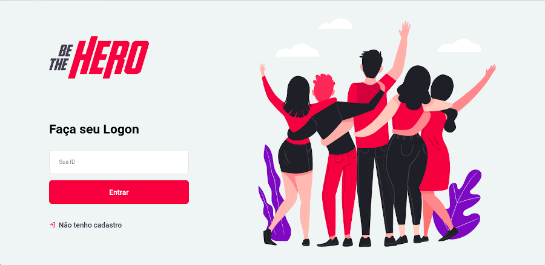
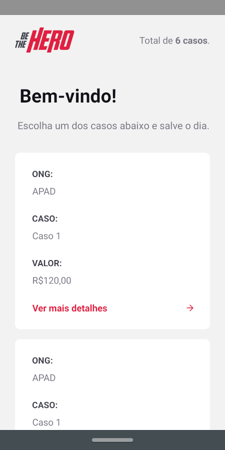

<!-- então bora codar! -->

<h1 align="center">
    
</h1>

<h2 align="center"> Aplicação para conectar ONGs e outras instituições a pessoas que tem disponibilidade para ajudar </h2>

### :rocket: Tecnologias usadas
Este projeto foi desenvolvido com as seguintes tecnologias:
- [Node.js](https://nodejs.org/en/)
- [Expo](https://expo.io/)
- [Express](https://expressjs.com/pt-br/)
- [ExpressJs](https://expressjs.com/pt-br/)
- [Nodemon](https://www.npmjs.com/package/nodemon)
- [Axios](https://www.npmjs.com/package/axios)
- [Cors](https://www.npmjs.com/package/cors)
- [Eslint](https://www.npmjs.com/package/eslint)
- [Jest](https://www.npmjs.com/package/jest)

## Para rodar a aplicação

> OBS: pode-se utilizar o gerenciador de pacotes npm ou o yarn para rodar os comandos abaixo

Execute ```npm install``` nas pastas backend, frontend e mobile, para instalar as dependências.

Rode ```npm start``` nas pastas backend e frontend para utilizar a versão web. Acesse via **localhost:3000**.

Rode ```npm start``` nas pastas backend e mobile, acesse **localhost:19002**, leia o QR Code no seu celular e utilize o aplicativo  Expo para rodar a versão mobile no seu smartphone. Ou com algum emulador Android/iOS para rodar no seu computador.

## Telas

[Layout](https://www.figma.com/file/2C2yvw7jsCOGmaNUDftX9n/Be-The-Hero---OmniStack-11?node-id=0%3A1) da aplicação no  Figma.

<p align="center">
    
    
    
    
    
    
    
</p>

---

**Instrutor: [Diego Fernandes](https://github.com/diego3g) | CTO Rocketseat**

## Licença
[MIT](https://github.com/menderson/be-the-hero-omniStack11/blob/master/LICENSE)

---

<h4 align="center"> <em>&lt;/&gt;</em> by <a href="https://github.com/menderson" target="_blank">mendersoncosta</a> </h4>
